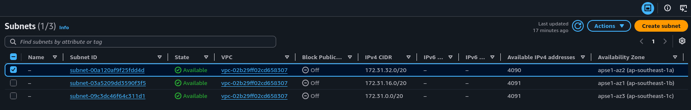
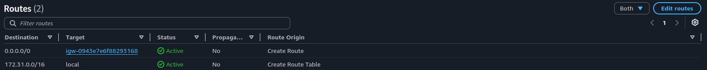
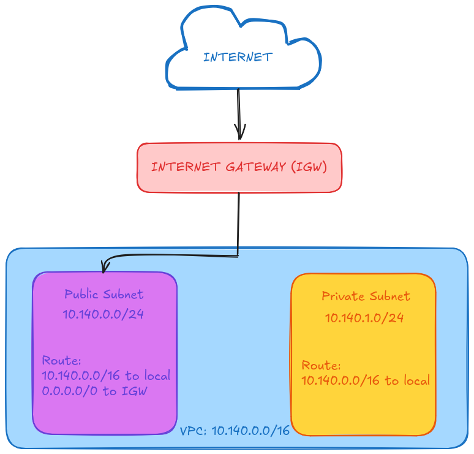

# Assignment 2 Submission

<!--
How to use this template:

1. Copy this file to submissions/assignment-2/<your-github-username>/submission.md
2. Replace every answer placeholder with your own answer. Delete the angle brackets too.
3. Save your four images in the same folder, with the exact file names below.
4. Do not write your full name or your student number in this file.
-->

## About me

- GitHub username: zanis3
- Section: IV-DCSAD
- IAM user name that I signed in with: dcsad-g02
- X: 140

---

## Part A. Explore

### A1. The VPC

Default VPC IPv4 CIDR:

172.31.0.0/16

Number of addresses in that CIDR:

`10.0.0.0` to `10.0.255.255`

### A2. The subnets

| Availability Zone | IPv4 CIDR |
| --- | --- |
| apse1-az2 (ap-southeast-1a) | 172.31.32.0/20 |
| apse1-az1 (ap-southeast-1b) | 172.31.16.0/20 |
| apse1-az3 (ap-southeast-1c) | 172.31.0.0/20 |

Screenshot 1. Save it as `screenshot-1-subnets.png` in your folder. The image line below shows it.

### A3. Available addresses

Available IPv4 addresses in each subnet:

4090-4091

Why is the number lower than 4,096?

A /20 subnet contains 4,096 IPv4 addresses, but AWS reserves five IP addresses in every subnet for networking purposes. Therefore, only 4,091 addresses are normally available for use.

What uses the missing address in the subnet with the lowest number?

The additional address is being used by the EC2 instance "umak-elec3-week3-demo" through its network interface (eni-06f633094f67646ed).

### A4. The route table

| Destination | Target |
| --- | --- |
| 0.0.0.0/0 | igw-0943e7e6f88293168 |
| 172.31.0.0/16 | local |

Screenshot 2. Save it as `screenshot-2-routes.png` in your folder. The image line below shows it.

### A5. Public or private

Are the default subnets public or private? Which route proves it?

The default subnets are public because their route table has a route from 0.0.0.0/0 to an Internet Gateway. The 0.0.0.0/0 route that targets igw-0945e7e6f88293168 proves that the subnets have a route to the Internet Gateway.

### A6. The internet gateway

State of the internet gateway:

Attached

What happens to the default subnets if the gateway is detached?

The VPC would lose its connection to the internet. The routes pointing to the Internet Gateway would no longer provide internet connectivity.

### A7. NAT gateways

Number of NAT gateways:

0

Can a server in a new private subnet download updates? Why?

No. There are no NAT gateways in the VPC, so a server in a private subnet would not have a route through a NAT gateway to access the internet for downloading updates.

### A8. The network ACL

| Rule number | Source | Allow or Deny |
| --- | --- | --- |
| 100 | 0.0.0.0/0 | Allow |
| * | 0.0.0.0/0 | Deny |

How is a network ACL different from a security group?

A network ACL controls traffic at the subnet level, while a security group controls traffic at the resource level. A network ACL can allow or deny traffic, while a security group only allows traffic. A network ACL is also stateless, while a security group is stateful.

Screenshot 3. Save it as `screenshot-3-network-acl.png` in your folder. The image line below shows it.

### A9. The default security group

Inbound rule (type and source):

Type: All traffic | Source: sg-0c5b6d4081cf0a534 / default

Which resources can send traffic to an instance that uses it?

Any resource that uses the same default security group as its security group can send traffic to the instance.

---

## Part B. Prepare

### B1. Plan two subnets

- Public subnet CIDR: 10.140.0.0/24
- Private subnet CIDR: 10.140.1.0/24

### B2. Route tables

Route table of the public subnet:

| Destination     | Target             |
| --------------- | ------------------ |
| `10.140.0.0/16` | `local`            |
| `0.0.0.0/0`     | `Internet Gateway` |

Route table of the private subnet:

| Destination     | Target  |
| --------------- | ------- |
| `10.140.0.0/16` | `local` |

### B3. My VPC diagram

Tool used (Excalidraw, draw.io, Lucidchart, or paper):

Excalidraw

Save your diagram as `vpc-diagram.png` in your folder. The image line below shows it.

### B4. Predict a change

Can you still open the web page from your laptop? Why?

No because the instance would no longer have a route from its subnet to the Internet Gateway. The 0.0.0.0/0 route is what provides the path to destinations outside the VPC.

Can the instance still reach another instance in the VPC? Why?

Yes because the local route for 10.140.0.0/16 still allows communication between resources within the VPC.

### B5. Place a database

Which subnet gets the database? Why?

The private subnet. A database should not have a direct route to the Internet Gateway, so placing it in the private subnet keeps it from being directly accessible from the internet.

### B6. My question about VPCs

What is your question, and what made you think of it?

While doing the activity about VPC, my initial question was that how do VPC, subnets, route tables, Internet Gateways, Network ACLs, and security groups relate to Cloud Computing as a whole? I thought about this because I learned how each part works individually, but I wanted to understand how they work together and also why they are important when using cloud computing services.
